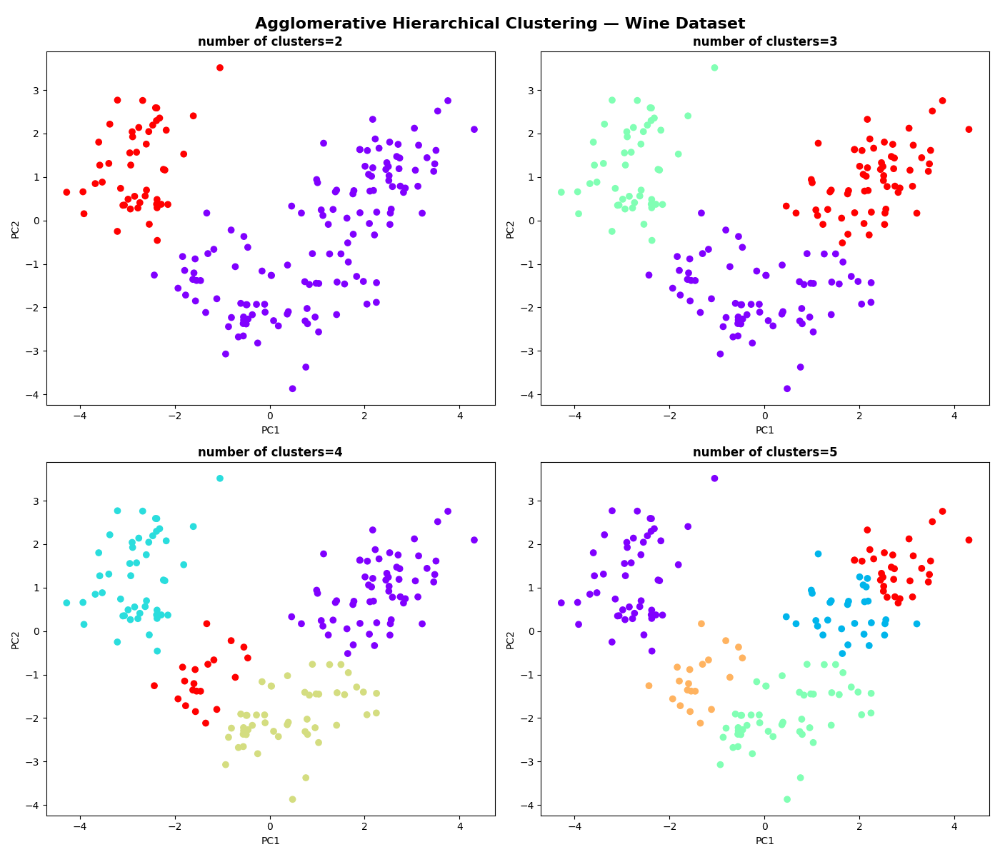
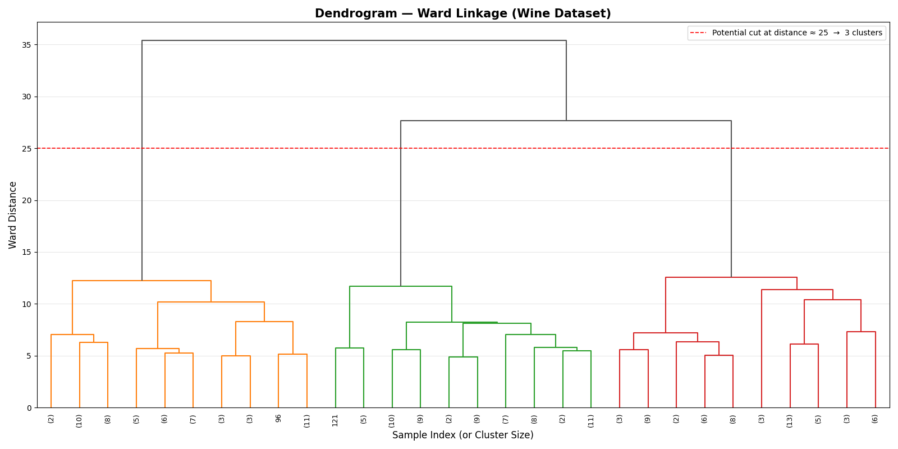
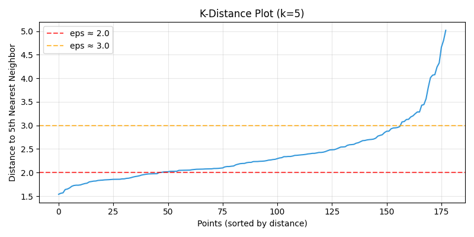
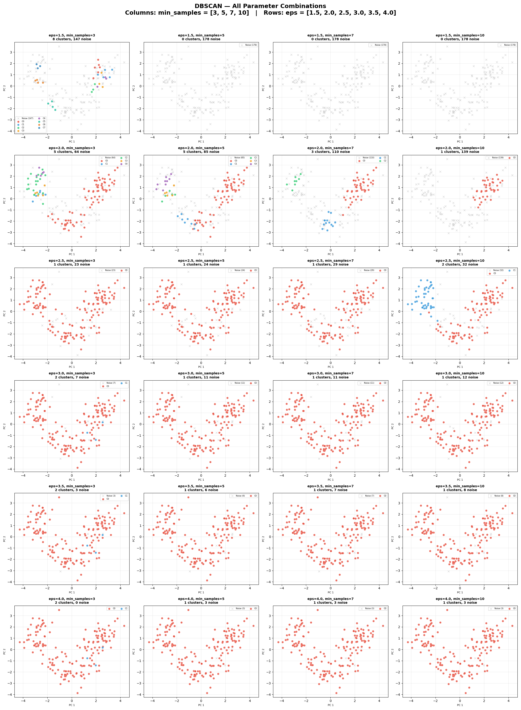
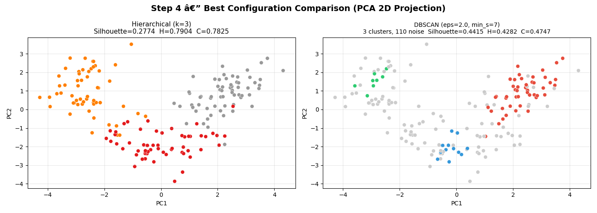

# MSCS-634 Lab 5: Clustering Techniques Using DBSCAN and Hierarchical Clustering

### Laxmi Kanth Oruganti
### MSCS-634: Advanced Big Data and Data Mining

## Purpose

In this lab, I applied two unsupervised clustering techniques — DBSCAN (Density-Based Spatial Clustering of Applications with Noise) and Hierarchical (Agglomerative) Clustering — on the Scikit-learn Wine dataset. The goal was to understand how each algorithm groups data differently, how sensitive they are to parameter choices, and when one approach makes more sense than the other. Since this is unsupervised learning, there are no target labels to optimize against during training, so I evaluated results using Silhouette Score, Homogeneity Score, and Completeness Score, and compared the discovered clusters against the known wine cultivar labels to see how well each method recovered the real structure.

## Dataset

The Wine dataset has **178 samples** with **13 features** — things like alcohol content, malic acid, ash, magnesium, total phenols, flavanoids, and proline, all measured from wines produced by three different cultivars in Italy. The features have very different scales (proline ranges from 278–1680 while most others are single digits), so I standardized everything with `StandardScaler` before running either algorithm. The true class labels were held aside and only used for post-hoc evaluation with homogeneity and completeness scores.

## Results

### Step 1: Data Preparation

After loading the dataset, I used `.info()` and `.describe()` to understand the structure — all 178 rows were complete with no missing values, and all 13 columns were float64. The wide range on `proline` was immediately obvious and confirmed that standardization was necessary before computing any distances.

### Step 2: Hierarchical (Agglomerative) Clustering

I used Ward linkage with Agglomerative Clustering and tested `n_clusters` values from 2 through 5. The PCA projection (55.41% explained variance across 2 components) let me visualize the clusters in 2D.

Looking at the four plots, k=3 gave the cleanest separation. k=2 lumped two real groups together, and k=4 or k=5 just fragmented real clusters without adding anything meaningful. To confirm the choice, I generated a dendrogram.

The dendrogram showed a clear gap in merge distances around distance ≈ 25, which pointed to 3 clusters as the natural cut point. That matched the actual number of wine cultivars, so I went with `n_clusters=3` for the final evaluation.

| Metric | Value |
|---|---|
| n_clusters | 3 |
| Linkage | Ward |
| Silhouette Score | **0.2774** |
| Homogeneity Score | **0.7904** |
| Completeness Score | **0.7825** |

Homogeneity and completeness both coming in around 0.78–0.79 means the algorithm's clusters lined up closely with the real wine cultivar labels — even without ever seeing them during training. That's a strong result for an unsupervised method.

### Step 3: DBSCAN Clustering

DBSCAN needed a lot more tuning. I first generated a k-distance plot (k=5) to estimate a reasonable starting range for `eps`.

The elbow in the plot fell roughly between 2.0 and 3.0, so I tested `eps` values of 1.5, 2.0, 2.5, 3.0, 3.5, and 4.0, each combined with `min_samples` values of 3, 5, 7, and 10 — 24 combinations total. The grid results are shown below.

The grid made the sensitivity problem very visible. At `eps=1.5`, the top rows are almost entirely gray noise points with barely any real clusters. In the middle rows around `eps=2.0`, a few colored clusters start appearing but noise is still high. By `eps=3.5–4.0`, everything collapses into one or two giant blobs.

The numerical results for the most informative configurations:

| eps | min_samples | Clusters | Noise Points | Silhouette Score | Homogeneity | Completeness |
|---|---|---|---|---|---|---|
| 1.5 | 3 | 8 | 147 | 0.3311 | 0.1892 | 0.2510 |
| 1.5 | 5–10 | 0 | 178 | N/A | N/A | N/A |
| 2.0 | 3 | 5 | 64 | 0.2113 | 0.4423 | 0.3724 |
| 2.0 | 5 | 5 | 85 | 0.2405 | 0.3624 | 0.3247 |
| **2.0** | **7** | **3** | **110** | **0.4415** | **0.4282** | **0.4747** |
| 2.0 | 10 | 1 | 139 | N/A | 0.2887 | 0.5963 |
| 2.5 | 10 | 2 | 32 | 0.3228 | 0.5045 | 0.5604 |
| 3.0 | 3 | 2 | 7 | 0.2392 | 0.0311 | 0.1347 |

The best configuration was **eps=2.0, min_samples=7** — the only combo that produced exactly 3 clusters with a usable Silhouette Score (0.4415). But it still flagged 110 out of 178 points as noise, which is 62% of the dataset thrown away.

### Step 4: Best Configuration Comparison

After identifying the best configuration for each algorithm, I ran them side by side and compared the results directly.

The left plot (Hierarchical, k=3) shows three reasonably well-separated clusters covering all 178 points. The right plot (DBSCAN, eps=2.0, min_samples=7) shows three small clusters in color, but the majority of points are gray — labeled as noise. Visually, DBSCAN's clusters are more internally compact (higher Silhouette), but they only describe a small fraction of the data.

| Algorithm | Clusters Found | Noise Points | Silhouette Score | Homogeneity | Completeness |
|---|---|---|---|---|---|
| Hierarchical (Ward, k=3) | 3 | 0 | 0.2774 | 0.7904 | 0.7825 |
| DBSCAN (eps=2.0, min_s=7) | 3 | 110 | 0.4415 | 0.4282 | 0.4747 |

Hierarchical clustering was the clear winner overall. Its Silhouette Score was lower, but it assigned all 178 points, and its homogeneity (0.79) and completeness (0.78) were nearly double what DBSCAN achieved. DBSCAN's higher Silhouette is a bit misleading — it only evaluated the 68 non-noise points, not the full dataset.

## Key Insights

### How Well Each Method Performed
- **Hierarchical Clustering** recovered the actual wine cultivar structure very closely. Scores around 0.78–0.79 for both homogeneity and completeness show the clusters largely matched the real labels. The dendrogram made picking the right cluster count straightforward, and Ward linkage worked well because the Wine features form compact groups in standardized space.
- **DBSCAN** struggled with this dataset. Even its best run discarded 62% of the data as noise. The homogeneity and completeness scores (0.43 and 0.47) show that its clusters only loosely corresponded to the real cultivar groups. The Wine dataset just doesn't have the density gaps DBSCAN is designed to exploit.
- The **k-distance plot** was genuinely useful for narrowing down the `eps` search range to 2.0–3.0, but the elbow wasn't sharp enough to give a precise value — I still needed to run the full grid to find what actually worked.

### What the Clusters Actually Represent
The three natural groups in the Wine dataset correspond to wines from three Italian cultivars. Looking at the hierarchical clusters, they roughly separate by alcohol level and phenol chemistry: one group tends toward higher alcohol and proline, another has high flavanoids and moderate color intensity, and the third has higher malic acid and lower phenols. These distinctions make sense for wines from different producers using different grape varietals.

### Which Method Fit This Data Better
Hierarchical clustering was clearly the better fit. The Wine dataset has compact, reasonably well-separated groups in feature space — that plays right into Ward linkage's strengths. DBSCAN is built for datasets with actual density gaps between irregular-shaped clusters and genuine outliers that need to be identified. The Wine dataset has neither, which is why DBSCAN's noise rate stayed high across almost all parameter combinations.

## Challenges and Decisions

- **Tuning DBSCAN parameters was the hardest part.** The grid visualization made it obvious just how unstable the output was — a 0.5 change in `eps` could flip between 0 clusters and 8 clusters. Using the k-distance plot helped me start in the right range, but I still needed all 24 combinations to find the one configuration worth using.
- **Evaluating DBSCAN fairly was tricky.** The Silhouette Score only covers non-noise points, so a high score doesn't necessarily mean a good clustering if most of the data was excluded. Using homogeneity and completeness alongside silhouette gave a more honest picture.
- **Deciding where to cut the dendrogram** took some interpretation. The gap at distance ≈ 25 was visible, but I validated it by checking k=2 through k=5 in the scatter plots — k=3 was the only one where the cluster boundaries looked clean and the scores were highest.
- **13-feature space** made Euclidean distance noisier, which contributed to DBSCAN's sensitivity. The k-distance elbow was softer than I'd expect for lower-dimensional data, making the `eps` choice genuinely uncertain rather than obvious.

## What I Learned

- Hierarchical clustering with a dendrogram is one of the most practical tools when you don't know how many clusters exist — the visual feedback is far more informative than just guessing or relying on metrics alone.
- DBSCAN works best when there are real density gaps and genuine outliers in the data. For compact, well-separated clusters like the Wine dataset, it's the wrong tool, and the high noise rate is the signal to try something else.
- A high Silhouette Score from DBSCAN can be misleading if most of the data was labeled as noise and excluded from the calculation. Always check the noise fraction before interpreting the score.
- Systematic grid search with a visualization grid (like the 6×4 DBSCAN plot) is worth the effort — it shows the parameter sensitivity all at once and makes the decision much more defensible than running a few random combinations.
- Choosing the right algorithm matters more than tuning the right parameters. Both methods found 3 clusters, but one matched reality closely and the other mostly discarded the data — because their underlying assumptions did and didn't fit this dataset respectively.
